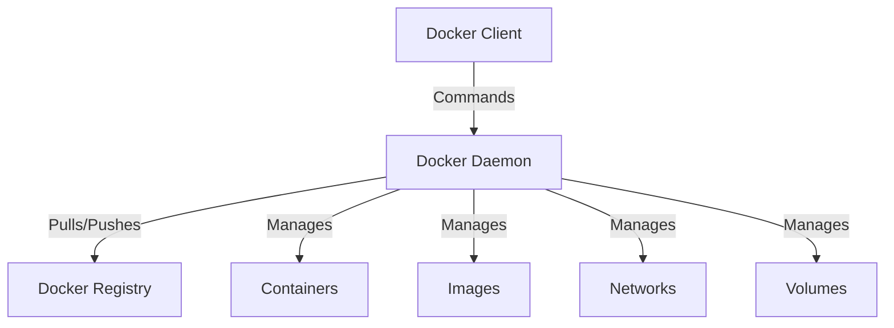

# Docker Overview

## What is Docker?

Docker is an open-source platform that automates the deployment, scaling, and management of applications using containerization technology. It packages applications and their dependencies into standardized units called containers, which can run consistently across different environments.

## 🌟 Key Concepts

### Containers
- Lightweight, standalone executable packages
- Contains everything needed to run an application:
  - Code
  - Runtime environment
  - System tools
  - System libraries
  - Settings
- Runs consistently across different environments
- Isolated from other containers and the host system

### Images
- Read-only templates used to create containers
- Like a "snapshot" of an application and its environment
- Can be version-controlled and shared
- Built using a Dockerfile
- Stored in registries (like Docker Hub)

### Container vs. Virtual Machine

| Feature | Container | Virtual Machine |
|---------|-----------|-----------------|
| Size | Lightweight (MBs) | Heavy (GBs) |
| Boot Time | Seconds | Minutes |
| OS | Shares host OS | Needs full OS |
| Performance | Near native | Overhead |
| Isolation | Process-level | Complete |
| Resource Usage | Low | High |

## 🔧 Docker Architecture

### Client-Server Architecture
1. **Docker Client**
   - Command-line interface (CLI)
   - Communicates with Docker daemon
   - Handles `docker` commands

2. **Docker Daemon**
   - Manages Docker objects
   - Handles container operations
   - Runs on the host system

3. **Docker Registry**
   - Stores Docker images
   - Can be public (Docker Hub) or private
   - Used for sharing and distribution

## 🎯 Benefits of Using Docker

### 1. Consistency
- Same environment across development, testing, and production
- "Works on my machine" problem solved
- Reproducible builds and deployments

### 2. Isolation
- Applications run in isolated environments
- No conflicts between different versions of dependencies
- Secure by default

### 3. Portability
- Run anywhere Docker is installed
- Easy migration between cloud providers
- Simple backup and restore

### 4. Scalability
- Easy to scale applications horizontally
- Quick startup and shutdown
- Efficient resource utilization

### 5. Development and Deployment
- Faster development cycles
- Easy continuous integration/deployment
- Simple version control for entire application stacks

## 🛠️ Common Use Cases

1. **Microservices Architecture**
   - Breaking down applications into smaller services
   - Independent deployment and scaling
   - Easy service isolation and management

2. **Development Environments**
   - Consistent development environments
   - Quick onboarding of new developers
   - Isolation of project dependencies

3. **Continuous Integration/Deployment**
   - Automated testing environments
   - Consistent build environments
   - Reliable deployments

4. **Cloud Migration**
   - Platform-independent deployments
   - Easy migration between cloud providers
   - Hybrid cloud setups

## 📈 Docker's Impact on Modern Development

### Industry Adoption
- Widely adopted by major tech companies
- Standard for container technology
- Large community and ecosystem

### DevOps Integration
- Essential tool for DevOps practices
- Enables Infrastructure as Code
- Facilitates automated deployments

### Cloud Native Development
- Core component of cloud-native applications
- Works well with orchestration tools (Kubernetes)
- Enables modern application architectures

## 🚀 Getting Started

To begin working with Docker:

1. Install Docker on your system
2. Learn basic Docker commands
3. Understand Dockerfile syntax
4. Practice building and running containers
5. Explore Docker Compose for multi-container applications

## 📚 Related Topics

- Container Orchestration (Kubernetes, Docker Swarm)
- Microservices Architecture
- DevOps Practices
- Cloud Computing
- Continuous Integration/Deployment (CI/CD)

## 🔍 Additional Resources

- [Official Docker Documentation](https://docs.docker.com/)
- [Docker Hub](https://hub.docker.com/)
- [Docker Community Forums](https://forums.docker.com/)
- Docker Best Practices Guide (see section 10)

---

**Next Section**: [Container Basics](2.%20Container%20Basics.md)