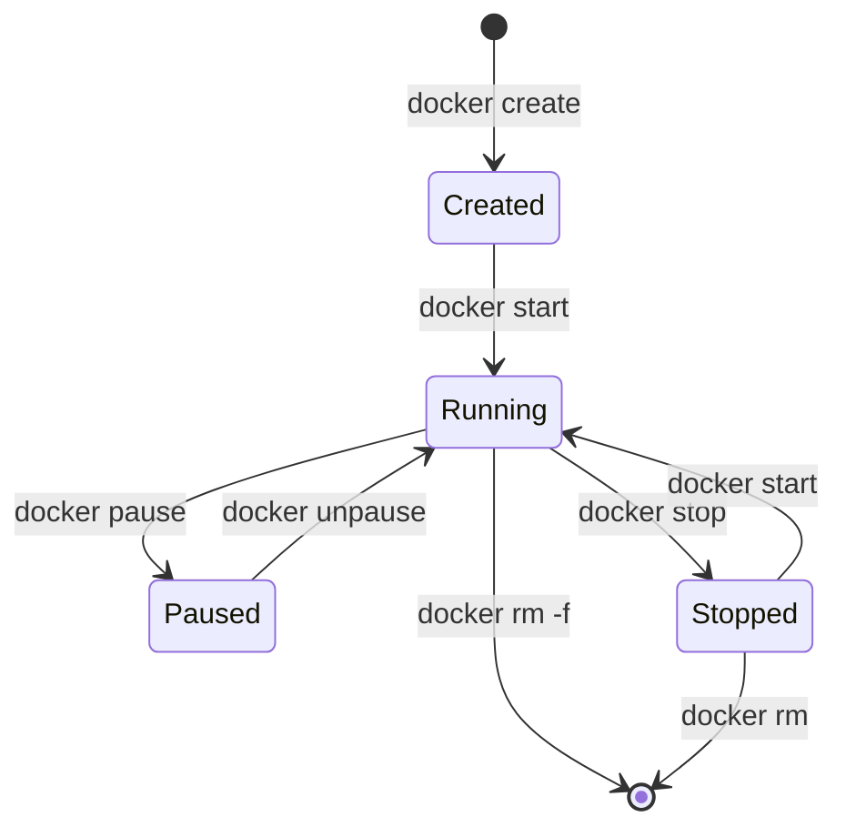

# Container Basics

## What is a Container?

A container is a standard unit of software that packages code and all its dependencies so that the application runs quickly and reliably across different computing environments. Think of it as a lightweight, standalone, and executable package that includes everything needed to run an application.

## 🏗️ Container Structure

### Components
1. **Application Code**
   - Your actual application
   - Application files
   - Configuration files

2. **Runtime Environment**
   - Programming language runtime
   - Required libraries
   - System tools

3. **System Libraries**
   - Shared libraries
   - System dependencies
   - Binary files

4. **Configuration**
   - Environment variables
   - Configuration files
   - Runtime settings

## 🔄 Container Lifecycle



### Basic Container States
1. **Created**
   - Container is created but not started
   - Resources are allocated
   
2. **Running**
   - Container is executing
   - Processes are active
   
3. **Paused**
   - Container processes are temporarily suspended
   - Memory state is preserved
   
4. **Stopped**
   - Container is stopped but exists
   - Can be restarted
   
5. **Deleted**
   - Container is removed
   - Resources are freed

## 🛠️ Basic Container Operations

### Creating and Running Containers
```bash
# Run a container
docker run [options] image [command]

# Common options:
-d, --detach        # Run in background
-p, --publish       # Publish ports
-v, --volume        # Mount volumes
-e, --env           # Set environment variables
--name              # Assign container name
```

### Managing Container State
```bash
# Start container
docker start container_name

# Stop container
docker stop container_name

# Pause container
docker pause container_name

# Unpause container
docker unpause container_name

# Remove container
docker rm container_name
```

### Viewing Container Information
```bash
# List running containers
docker ps

# List all containers
docker ps -a

# View container logs
docker logs container_name

# Container details
docker inspect container_name

# Container resource usage
docker stats container_name
```

## 📊 Resource Management

### Memory
```bash
# Limit memory
docker run --memory="512m" image_name

# Memory soft limit
docker run --memory-reservation="256m" image_name
```

### CPU
```bash
# Limit CPU cores
docker run --cpus="1.5" image_name

# Set CPU shares
docker run --cpu-shares=512 image_name
```

### Storage
```bash
# Set storage limit
docker run --storage-opt size=10G image_name
```

## 🔌 Container Networking

### Network Types
1. **Bridge Network**
   - Default network type
   - Containers can communicate
   - Isolated from host

2. **Host Network**
   - Uses host's network
   - No network isolation
   - Better performance

3. **None Network**
   - No networking
   - Complete isolation

```bash
# Connect to network
docker run --network=bridge image_name

# Expose ports
docker run -p 8080:80 image_name
```

## 📦 Data Persistence

### Volumes
```bash
# Create and mount volume
docker volume create my_volume
docker run -v my_volume:/app/data image_name
```

### Bind Mounts
```bash
# Mount host directory
docker run -v /host/path:/container/path image_name
```

## 🔍 Container Inspection and Debugging

### Executing Commands
```bash
# Execute command in running container
docker exec -it container_name command

# Open shell in container
docker exec -it container_name /bin/bash
```

### Monitoring
```bash
# View logs
docker logs container_name

# Follow log output
docker logs -f container_name

# View resource usage
docker stats container_name
```

## 🎯 Best Practices

### 1. Resource Management
- Set appropriate resource limits
- Monitor resource usage
- Clean up unused containers

### 2. Security
- Run as non-root user
- Use read-only filesystems when possible
- Limit container capabilities

### 3. Networking
- Use custom networks for isolation
- Minimize exposed ports
- Use internal networks when possible

### 4. Data Management
- Use named volumes for persistence
- Back up important data
- Clean up unused volumes

## 🚨 Common Issues and Solutions

### 1. Container Won't Start
- Check logs: `docker logs container_name`
- Verify resource availability
- Check port conflicts

### 2. Container Crashes
- Review application logs
- Check resource limits
- Verify dependencies

### 3. Network Issues
- Check network configuration
- Verify port mappings
- Test container connectivity

## 📝 Examples

### Basic Web Server
```bash
# Run nginx web server
docker run -d \
  --name my_web \
  -p 8080:80 \
  nginx
```

### Database Container
```bash
# Run MySQL database
docker run -d \
  --name my_db \
  -e MYSQL_ROOT_PASSWORD=secret \
  -v mysql_data:/var/lib/mysql \
  mysql:8.0
```

## 🔗 Related Topics

- [Docker Images](../03.%20Working%20with%20Images/1.%20Docker%20Images.md)
- [Container Networking](../04.%20Container%20Management/2.%20Container%20Networking.md)
- [Data Volumes](../04.%20Container%20Management/3.%20Data%20Volumes.md)

---

**Next Section**: [Docker Architecture](3.%20Docker%20Architecture.md)