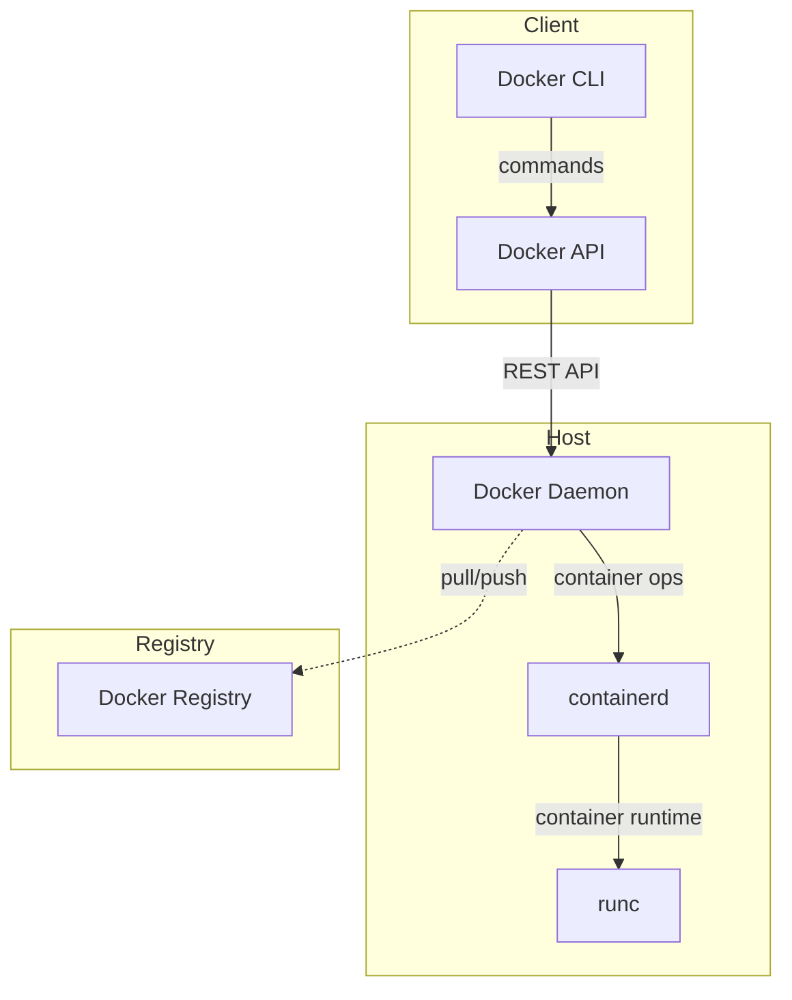
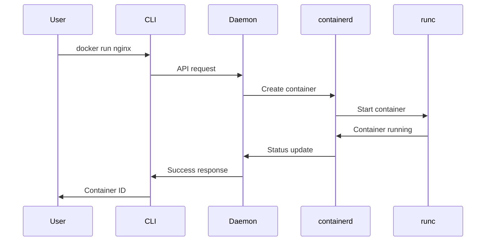
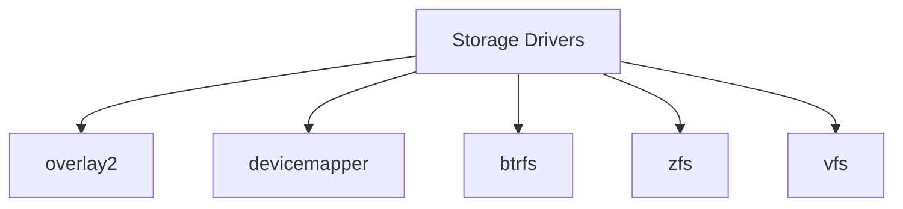
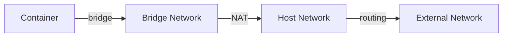

# Docker Architecture

## Overview of Docker Architecture

Docker uses a client-server architecture that consists of multiple components working together to create, manage, and run containers. Understanding this architecture is crucial for effectively working with Docker and troubleshooting issues.

## 🏗️ Core Components



### 1. Docker Client
- Primary way users interact with Docker
- Sends commands to Docker daemon
- Can communicate with multiple daemons

Components:
```bash
# Docker CLI
docker command [options]

# Docker API
curl -X GET http://localhost:2375/containers/json
```

### 2. Docker Daemon (dockerd)
- Heart of Docker
- Manages Docker objects
- Handles API requests

Configuration:
```bash
# Docker daemon config file
/etc/docker/daemon.json

# Start daemon with specific options
dockerd --debug --tls=true
```

### 3. containerd
- Industry-standard container runtime
- Manages container lifecycle
- Handles image transfer and storage

Features:
- Image management
- Container execution
- Low-level storage
- Network attachment

### 4. runc
- Low-level container runtime
- Creates containers
- Implements OCI specification

## 🔄 Process Flow



## 🏢 Component Architecture

### Docker Engine
```
┌─────────────────────────────────────────┐
│              Docker Engine              │
├─────────────────────────────────────────┤
│ REST API   │  Docker Daemon  │ Services │
├─────────────────────────────────────────┤
│           containerd                    │
├─────────────────────────────────────────┤
│              runc                       │
└─────────────────────────────────────────┘
```

## 🔌 Communication Paths

### 1. Local Communication
```bash
# Unix socket
/var/run/docker.sock

# TCP port (if enabled)
2375 (unencrypted)
2376 (encrypted)
```

### 2. Remote Communication
```bash
# Environment variables
export DOCKER_HOST="tcp://remote-host:2376"
export DOCKER_TLS_VERIFY="1"
```

## 📦 Storage Architecture

### 1. Storage Drivers


### 2. Directory Structure
```
/var/lib/docker/
├── containers/    # Container data
├── image/         # Image data
├── volumes/       # Named volumes
├── overlay2/      # Layer storage
└── swarm/         # Swarm data
```

## 🌐 Network Architecture

### 1. Network Drivers
- bridge
- host
- none
- overlay
- macvlan



## 🔐 Security Architecture

### 1. Security Layers
```
┌─────────────────────────────────────────┐
│              Namespaces                 │
├─────────────────────────────────────────┤
│              Control Groups             │
├─────────────────────────────────────────┤
│              Capabilities               │
├─────────────────────────────────────────┤
│              SELinux/AppArmor           │
└─────────────────────────────────────────┘
```

### 2. Security Features
- Namespace isolation
- Control groups
- Linux capabilities
- Mandatory Access Control

## 🛠️ Configuration

### 1. Daemon Configuration
```json
{
  "debug": true,
  "storage-driver": "overlay2",
  "dns": ["8.8.8.8"],
  "log-driver": "json-file",
  "log-opts": {
    "max-size": "10m"
  }
}
```

### 2. Client Configuration
```yaml
# ~/.docker/config.json
{
  "auths": {},
  "credHelpers": {},
  "plugins": {}
}
```

## 📊 Resource Management

### 1. Control Groups (cgroups)
- CPU
- Memory
- Block I/O
- Network

### 2. Resource Limits
```bash
# CPU limits
--cpus=2
--cpu-shares=1024

# Memory limits
--memory=2g
--memory-swap=4g
```

## 🔍 Troubleshooting Architecture

### 1. Logging
```bash
# Daemon logs
journalctl -u docker.service

# Container logs
docker logs container_name

# Debug mode
dockerd -D
```

### 2. Monitoring Points
- Docker daemon status
- Container states
- Resource usage
- Network connectivity

## 🎯 Best Practices

### 1. Security
- Use TLS for daemon communication
- Implement least privilege principle
- Regular security updates

### 2. Performance
- Use appropriate storage driver
- Monitor resource usage
- Optimize network configuration

### 3. Maintenance
- Regular cleanup of unused objects
- Monitoring system resources
- Backup of critical data

## 📚 Related Topics

- [Container Basics](./2.%20Container%20Basics.md)
- [Docker Security](../08.%20Security/1.%20Security%20Best%20Practices.md)
- [Networking](../06.%20Docker%20Networking/1.%20Network%20Types.md)

---

**Next Section**: [Installation Guide](../02.%20Getting%20Started/1.%20Installation%20Guide.md)